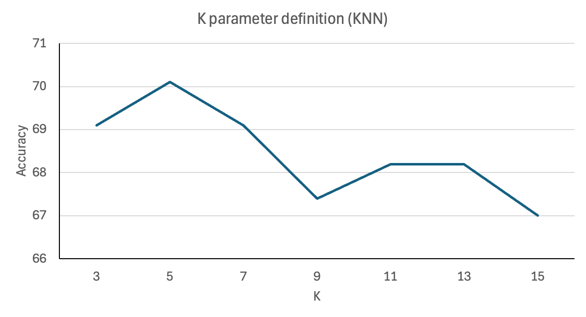
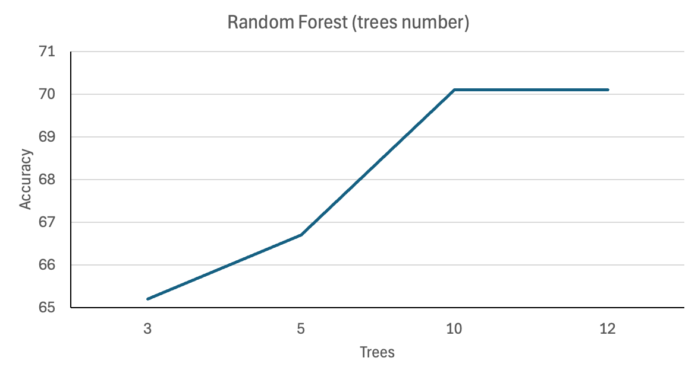
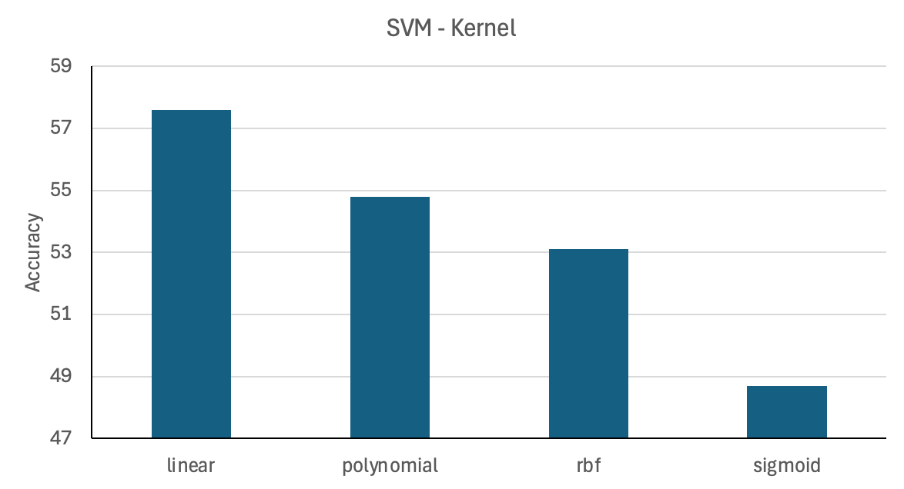
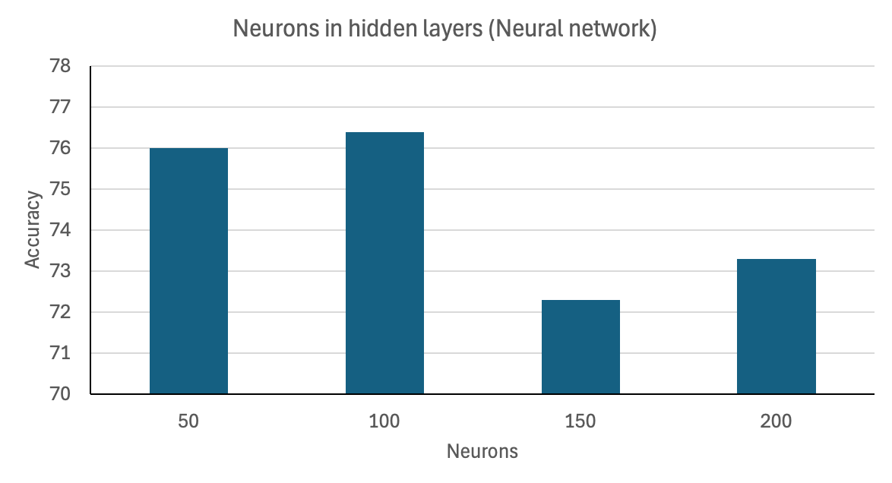
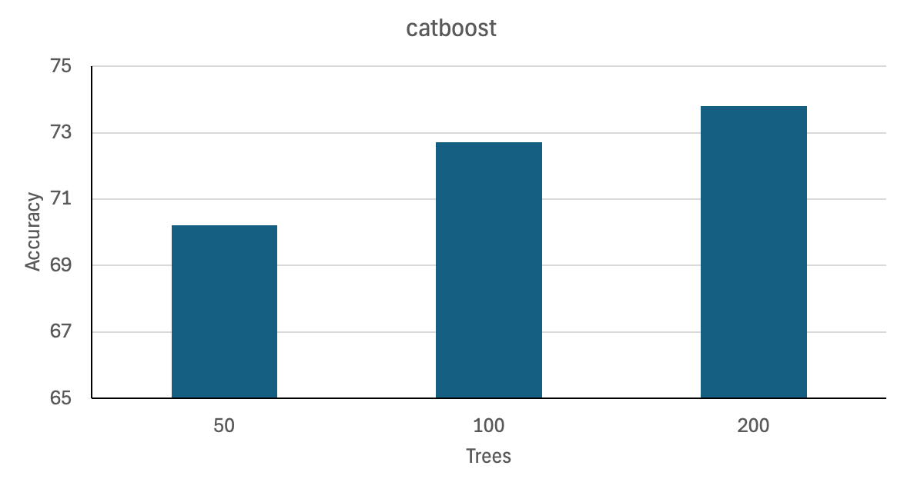
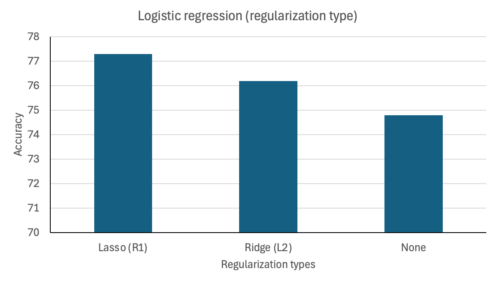
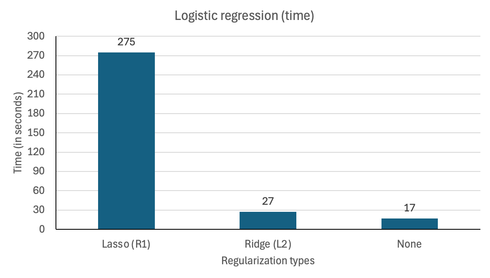
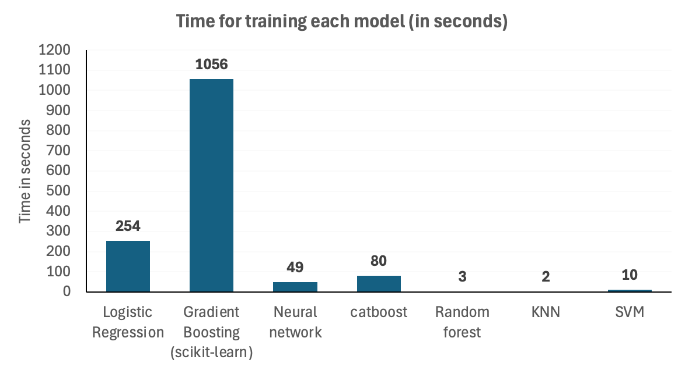

# Supplementary material for "A machine-learning approach for the detection of thermostable &beta;-glucosidases"

**Figure S1.** &nbsp;Accuracy values obtained for different hyperparameter definitions of the KNN model. K-values used: 3, 5, 7, 9, 11, 13, and 15.

**Figure S2.** &nbsp;Accuracy values obtained for different hyperparameter definitions of the Random Forest model. Number of trees used: 3, 5, 10, and 12.

**Figure S3.** &nbsp;Accuracy values obtained for different hyperparameter definitions of the SVM model. SVM Parameters used: linear, polynomial, rbf, and sigmoid. 

**Figure S4.**  Accuracy values obtained for different hyperparameter definitions of the Neural Network model. Number of neurons in hidden layers used: 50, 100, 150, and 200.

**Figure S5.**  Accuracy values obtained for different hyperparameter definitions of the catboost model. Number of trees used: 50, 100, and 200.

**Figure S6.** &nbsp;Accuracy values obtained for different hyperparameter definitions of the Logistic Regression model. Regularization types used: Lasso (R1), Ridge (L2), and None.

**Figure S7.** &nbsp;Time for training obtained for different hyperparameter definitions of the Logistic Regression model. Regularization types used: Lasso (R1), Ridge (L2), and None.

**Figure S8.** &nbsp;Time for training the models: Logistic Regression, Gradient Boosting (scikit-learn), Neural Network, catboost (Gradient Boosting), Random Forest, KNN, and SVM.

**Table S1.** Predictions for test dataset. GB: Gradient Boostin; LR: Logistic Regression; RF: Random Forest; NN: Neural Network.

| class    | uniprot_id | kNN      | catboost | GB       | LR       | RF       | NN       | SVM      | 
|----------|------------|----------|----------|----------|----------|----------|----------|----------|
| negative | A0A059AC90 | negative | negative | negative | negative | negative | negative | negative | 
| negative | A0A074RHH0 | positive | negative | negative | negative | negative | positive | negative | 
| negative | A0A098S657 | negative | negative | negative | positive | negative | negative | positive | 
| negative | A0A0A5GJ90 | negative | negative | negative | positive | negative | negative | positive | 
| negative | A0A0B2A6F6 | negative | negative | positive | negative | negative | negative | negative | 
| negative | A0A0B7K2D4 | positive | positive | positive | positive | positive | positive | negative | 
| negative | A0A0B7NZM3 | negative | negative | negative | positive | positive | negative | positive | 
| negative | A0A0D3VHQ8 | negative | positive | negative | negative | negative | negative | positive | 
| negative | A0A0F2C6I0 | negative | negative | negative | negative | negative | negative | negative | 
| negative | A0A0G0PX59 | positive | positive | positive | negative | positive | positive | positive | 
| negative | A0A0G1KYW0 | negative | negative | negative | negative | negative | positive | negative | 
| negative | A0A0G4LFR0 | negative | negative | negative | positive | negative | negative | positive | 
| negative | A0A0G4M3V7 | positive | negative | negative | negative | negative | negative | negative | 
| negative | A0A0J8R577 | positive | negative | negative | negative | negative | negative | negative | 
| negative | A0A0M3UGE2 | negative | negative | negative | negative | negative | negative | negative | 
| negative | A0A0M8M8Q6 | negative | negative | negative | negative | negative | negative | positive | 
| negative | A0A0N0HMH4 | negative | negative | negative | negative | negative | negative | negative | 
| negative | A0A0P0DJG5 | negative | negative | negative | negative | negative | negative | positive | 
| negative | A0A0Q4LEX0 | negative | negative | negative | positive | positive | negative | negative | 
| negative | A0A0Q6VNH8 | negative | negative | negative | negative | negative | negative | negative | 
| negative | A0A0Q9EMW1 | negative | negative | negative | negative | negative | negative | negative | 
| negative | A0A0Q9T503 | negative | negative | negative | positive | negative | negative | negative | 
| negative | A0A0S8EAX1 | positive | positive | positive | negative | negative | positive | negative | 
| negative | A0A0T0M7W1 | positive | negative | negative | negative | negative | negative | positive | 
| negative | A0A0U1M0X8 | positive | negative | negative | negative | negative | negative | positive | 
| negative | A0A0U5GRR2 | negative | negative | negative | negative | negative | negative | positive | 
| negative | A0A0U5J538 | positive | positive | positive | negative | positive | positive | negative | 
| negative | A0A135LTE4 | negative | negative | negative | negative | negative | negative | positive | 
| negative | A0A135V3S4 | negative | negative | negative | negative | negative | negative | positive | 
| negative | A0A146GCV4 | negative | negative | negative | negative | negative | positive | positive | 
| negative | A0A173MGM2 | negative | negative | negative | negative | negative | negative | positive | 
| negative | A0A174CG08 | positive | positive | positive | negative | positive | positive | positive | 
| negative | A0A174JA73 | negative | negative | negative | positive | negative | negative | positive | 
| negative | A0A174KH58 | negative | negative | negative | negative | negative | negative | positive | 
| negative | A0A174NZ99 | negative | negative | negative | negative | negative | negative | positive | 
| negative | A0A174VV74 | negative | negative | negative | negative | negative | negative | positive | 
| negative | A0A177K7Y7 | negative | positive | positive | negative | negative | positive | negative | 
| negative | A0A191WK02 | positive | negative | negative | negative | positive | negative | negative | 
| negative | A0A1C4LFC9 | negative | negative | negative | negative | negative | negative | negative | 
| negative | A0A1C5QUE8 | negative | positive | negative | positive | positive | positive | positive | 
| negative | A0A1E1K1H4 | negative | negative | negative | negative | negative | negative | negative | 
| negative | A0A1E5PFU5 | positive | negative | negative | negative | negative | negative | negative | 
| negative | A0A1E5PRD2 | negative | negative | negative | negative | positive | negative | negative | 
| negative | A0A1G4AMS7 | negative | negative | negative | positive | negative | negative | negative | 
| negative | A0A1G6C2R6 | negative | negative | negative | negative | negative | negative | positive | 
| negative | A0A1G9WNI1 | negative | negative | negative | negative | negative | negative | positive | 
| negative | A0A1H2BAC0 | negative | negative | negative | negative | negative | negative | negative | 
| negative | A0A1H4VSJ7 | positive | positive | negative | negative | negative | positive | negative | 
| negative | A0A1H6KQ45 | negative | negative | negative | negative | negative | negative | positive | 
| negative | A0A1H7P2G7 | negative | negative | negative | positive | negative | negative | positive | 
| negative | A0A1H7UW29 | negative | negative | negative | positive | negative | positive | negative | 
| negative | A0A1H8KCV9 | positive | negative | negative | negative | negative | negative | negative | 
| negative | A0A1I6BJA0 | negative | negative | negative | negative | negative | negative | negative | 
| negative | A0A1I6PZJ8 | negative | negative | negative | negative | positive | negative | positive | 
| negative | A0A1J5HEG2 | negative | negative | negative | positive | negative | negative | negative | 
| negative | A0A1L7WSE0 | negative | negative | negative | negative | positive | negative | negative | 
| negative | A0A1L9R7T4 | negative | negative | negative | negative | negative | negative | positive | 
| negative | A0A1M3LPG6 | negative | negative | negative | negative | negative | negative | positive | 
| negative | A0A1M7N9M1 | negative | negative | negative | positive | negative | negative | negative | 
| negative | A0A1Q7M7R7 | negative | positive | positive | negative | negative | negative | negative | 
| negative | A0A1Q7WHV7 | negative | negative | negative | negative | positive | negative | negative | 
| negative | A0A1Q8A2N5 | positive | negative | negative | negative | negative | negative | negative | 
| negative | A0A1S4CR57 | negative | negative | negative | negative | negative | negative | negative | 
| negative | A0A1T4RCN0 | negative | positive | negative | negative | negative | negative | positive | 
| negative | A0A1U8MZP0 | negative | negative | negative | negative | negative | negative | negative | 
| negative | A0A1V2KYN0 | negative | negative | negative | negative | negative | negative | negative | 
| negative | A0A1V6QRB1 | negative | negative | positive | positive | negative | positive | negative | 
| negative | A0A1X1MRA8 | negative | negative | negative | negative | negative | negative | positive | 
| negative | A0A222JVF0 | negative | negative | negative | positive | negative | negative | negative | 
| negative | A0A257DZX9 | negative | negative | negative | negative | negative | negative | positive | 
| negative | A0A259N9V0 | negative | negative | negative | negative | positive | negative | positive | 
| negative | A0A2A9CVK8 | positive | negative | negative | negative | negative | negative | negative | 
| negative | A0A2C9W142 | negative | negative | negative | negative | negative | negative | positive | 
| negative | A0A2D7LHW7 | positive | positive | positive | negative | negative | negative | negative | 
| negative | A0A2E1ZTS1 | negative | negative | negative | positive | negative | negative | positive | 
| negative | A0A2E4M0I0 | negative | positive | positive | negative | positive | positive | positive | 
| negative | A0A2E8PP15 | positive | negative | positive | negative | positive | positive | positive | 
| negative | A0A2E9QF48 | positive | negative | negative | positive | negative | positive | positive | 
| negative | A0A2G6VVS2 | negative | negative | negative | negative | negative | negative | positive | 
| negative | A0A2H3C556 | negative | negative | negative | negative | negative | negative | positive | 
| negative | A0A2H3RK75 | negative | negative | negative | positive | negative | negative | negative | 
| negative | A0A2I0GCQ9 | positive | negative | negative | positive | negative | negative | negative | 
| negative | A0A2I4HNV7 | negative | negative | negative | negative | negative | negative | positive | 
| negative | A0A2I9CXC6 | negative | negative | positive | positive | negative | positive | negative | 
| negative | A0A2K9AYE8 | negative | negative | positive | negative | positive | negative | positive | 
| negative | A0A2M7G2Q5 | negative | negative | negative | positive | negative | negative | negative | 
| negative | A0A2M8AMH3 | positive | negative | negative | negative | negative | negative | positive | 
| negative | A0A2M9BL97 | negative | negative | negative | negative | negative | negative | positive | 
| negative | A0A2R7JSN1 | negative | positive | negative | positive | negative | negative | negative | 
| negative | A0A2S6XFW6 | positive | positive | negative | negative | positive | negative | positive | 
| negative | A0A2S7W8Z2 | negative | negative | negative | negative | negative | negative | positive | 
| negative | A0A2S9AG55 | negative | negative | negative | negative | negative | negative | positive | 
| negative | A0A2T2X554 | positive | negative | negative | negative | positive | negative | positive | 
| negative | A0A2T5BX83 | negative | negative | negative | negative | negative | negative | positive | 
| negative | A0A2T6D4I7 | negative | negative | negative | negative | negative | negative | positive | 
| negative | A0A2T6ZRE1 | negative | negative | negative | positive | positive | negative | negative | 
| negative | A0A2T8HI68 | negative | negative | negative | negative | negative | negative | positive | 
| negative | A0A2U3H6N8 | positive | negative | negative | positive | negative | negative | negative | 
| negative | A0A2W4QTR5 | positive | negative | negative | negative | positive | negative | negative | 
| negative | A0A317K9S6 | positive | positive | positive | positive | positive | negative | positive | 
| negative | A0A319ABX6 | negative | negative | negative | negative | negative | negative | positive | 
| negative | A0A326GJ08 | negative | negative | negative | negative | negative | negative | positive | 
| negative | A0A344LXU1 | negative | negative | negative | negative | negative | negative | negative | 
| negative | A0A349K013 | positive | negative | negative | positive | negative | negative | negative | 
| negative | A0A351X304 | positive | positive | negative | positive | positive | negative | positive | 
| negative | A0A367G1L2 | positive | positive | positive | positive | positive | positive | negative | 
| negative | A0A368ZUH9 | negative | negative | negative | negative | negative | negative | positive | 
| negative | A0A369W020 | positive | positive | positive | negative | negative | negative | negative | 
| negative | A0A374C6U6 | negative | negative | negative | negative | negative | negative | positive | 
| negative | A0A375E5S8 | negative | positive | positive | negative | positive | positive | negative | 
| negative | A0A397BC54 | positive | negative | negative | negative | negative | negative | positive | 
| negative | A0A3A9VVZ1 | negative | negative | negative | negative | negative | negative | negative | 
| negative | A0A3B6DKI4 | negative | negative | negative | negative | negative | negative | positive | 
| negative | A0A3C0IRE3 | negative | negative | negative | negative | negative | negative | negative | 
| negative | A0A3C1TNS0 | positive | negative | negative | negative | negative | negative | negative | 
| negative | A0A3C2A127 | negative | negative | negative | negative | negative | negative | negative | 
| negative | A0A3D2AAS0 | positive | negative | negative | positive | positive | negative | positive | 
| negative | A0A3D3MKM0 | negative | negative | negative | negative | negative | negative | positive | 
| negative | A0A3D4BSB1 | positive | negative | negative | negative | negative | negative | positive | 
| negative | A0A3D4X2A6 | negative | negative | negative | positive | negative | negative | negative | 
| negative | A0A3D5IA14 | negative | positive | positive | negative | negative | positive | negative | 
| negative | A0A3D8RPI4 | negative | negative | negative | negative | negative | negative | positive | 
| negative | A0A3D9GBW7 | negative | negative | negative | positive | positive | negative | positive | 
| negative | A0A3D9N3K2 | positive | negative | negative | negative | positive | negative | positive | 
| negative | A0A3G6MHV2 | negative | negative | negative | negative | negative | negative | positive | 
| negative | A0A3G8H695 | negative | negative | negative | negative | negative | negative | positive | 
| negative | A0A3L6P7J5 | negative | negative | negative | positive | negative | negative | negative | 
| negative | A0A3L6RD10 | negative | negative | negative | negative | negative | negative | positive | 
| negative | A0A3M7JD16 | negative | negative | negative | negative | negative | positive | positive | 
| negative | A0A3N4KC50 | positive | negative | negative | positive | negative | negative | positive | 
| negative | A0A3Q9NRN4 | positive | negative | negative | negative | negative | negative | negative | 
| negative | A0A3R6A2W5 | negative | negative | negative | negative | negative | negative | positive | 
| negative | A0A3R9VHH2 | negative | positive | negative | negative | positive | negative | positive | 
| negative | A0A3T1TL36 | negative | negative | negative | negative | negative | negative | positive | 
| negative | A0A3Y5ACJ4 | negative | negative | negative | negative | negative | negative | negative | 
| negative | A0A402AWY6 | negative | negative | negative | positive | positive | positive | positive | 
| negative | A0A414DZ24 | negative | positive | positive | positive | positive | negative | positive | 
| negative | A0A417YNA5 | positive | negative | negative | negative | positive | positive | positive | 
| negative | A0A420J1V1 | positive | negative | negative | negative | negative | negative | negative | 
| negative | A0A426Y991 | positive | negative | negative | negative | negative | negative | negative | 
| negative | A0A427TRI7 | negative | negative | negative | negative | negative | negative | positive | 
| negative | A0A436ZRS7 | negative | negative | negative | negative | negative | positive | positive | 
| negative | A0A498KCE1 | positive | positive | negative | negative | negative | negative | negative | 
| negative | A0A4D4MPG0 | negative | negative | negative | negative | negative | negative | negative | 
| negative | A0A4J1VWJ6 | negative | positive | positive | negative | positive | positive | positive | 
| negative | A0A4P5X518 | negative | negative | negative | negative | negative | negative | negative | 
| negative | A0A4P7JIG7 | positive | positive | positive | negative | negative | positive | negative | 
| negative | A0A4Q4YP26 | positive | negative | positive | negative | negative | negative | positive | 
| negative | A0A4Q8S2N7 | negative | negative | negative | negative | negative | negative | positive | 
| negative | A0A4R0GA06 | negative | negative | negative | negative | negative | negative | negative | 
| negative | A0A4R1AKK8 | negative | negative | negative | negative | negative | negative | negative | 
| negative | A0A4R1RAB2 | positive | negative | negative | negative | negative | positive | negative | 
| negative | A0A4R2BMU0 | negative | negative | positive | negative | positive | negative | positive | 
| negative | A0A4R2M127 | negative | negative | negative | negative | negative | negative | positive | 
| negative | A0A4R3NE99 | positive | negative | negative | negative | negative | negative | negative | 
| negative | A0A4R6K2K0 | negative | negative | negative | negative | negative | negative | negative | 
| negative | A0A4R6KLH2 | negative | negative | negative | negative | negative | negative | negative | 
| negative | A0A4S2TXR9 | negative | negative | negative | positive | negative | negative | positive | 
| negative | A0A4S9I100 | negative | negative | negative | negative | negative | negative | negative | 
| negative | A0A4S9X076 | negative | negative | negative | negative | negative | negative | positive | 
| negative | A0A4T0T2W5 | negative | positive | negative | positive | negative | negative | positive | 
| negative | A0A4Z1EW19 | positive | negative | negative | negative | negative | negative | positive | 
| negative | A0A506U6X2 | negative | positive | negative | negative | negative | negative | positive | 
| negative | A0A511YJ65 | negative | negative | negative | negative | negative | negative | positive | 
| negative | A0A520C4B2 | negative | negative | positive | negative | negative | positive | negative | 
| negative | A0A536BYB0 | negative | positive | positive | positive | negative | positive | negative | 
| negative | A0A537KJ93 | negative | negative | negative | negative | negative | negative | negative | 
| negative | A0A537KP81 | negative | negative | negative | negative | positive | negative | positive | 
| negative | A0A542N4R9 | negative | negative | negative | negative | negative | negative | negative | 
| negative | A0A542YIC4 | negative | negative | negative | negative | negative | negative | negative | 
| negative | A0A554G598 | positive | negative | negative | negative | negative | negative | negative | 
| negative | A0A561EP58 | negative | negative | negative | negative | negative | negative | negative | 
| negative | A0A5B0D2S3 | negative | negative | negative | negative | negative | negative | negative | 
| negative | A0A5B9EKX4 | positive | negative | negative | negative | positive | negative | positive | 
| negative | A0A5C5R1W4 | negative | negative | negative | negative | negative | negative | positive | 
| negative | A0A5C6VKC5 | positive | negative | negative | negative | negative | positive | positive | 
| negative | A0A5C8Q8J7 | negative | negative | negative | negative | positive | negative | positive | 
| negative | A0A5D0VBD0 | negative | negative | negative | negative | negative | positive | negative | 
| negative | A0A5D2S711 | negative | negative | negative | negative | negative | negative | positive | 
| negative | A0A5J0IPI1 | negative | negative | negative | negative | negative | negative | positive | 
| negative | A0A5J5IGK4 | negative | negative | negative | negative | negative | negative | positive | 
| negative | A0A5J6U5L9 | positive | negative | positive | positive | negative | positive | negative | 
| negative | A0A5K1K514 | positive | negative | negative | positive | negative | negative | negative | 
| negative | A0A5M8P1F2 | positive | negative | negative | negative | negative | negative | positive | 
| negative | A0A5N6LWB7 | negative | negative | negative | negative | negative | negative | negative | 
| negative | A0A5R8WBT0 | negative | negative | negative | negative | negative | negative | positive | 
| negative | A0A5T3RRS1 | negative | negative | negative | negative | negative | negative | positive | 
| negative | A0A653Z0M5 | positive | negative | negative | negative | negative | negative | negative | 
| negative | A0A654G2Y9 | negative | negative | negative | negative | negative | negative | negative | 
| negative | A0A6A4LL00 | positive | negative | negative | negative | negative | negative | positive | 
| negative | A0A6A6UUC0 | positive | positive | positive | positive | positive | negative | positive | 
| negative | A0A6B3NIH9 | negative | negative | negative | negative | negative | negative | positive | 
| negative | A0A6C8H0R6 | negative | negative | negative | negative | negative | negative | positive | 
| negative | A0A6G1C6Z7 | negative | negative | negative | negative | negative | negative | positive | 
| negative | A0A6G2ZA09 | negative | negative | negative | negative | negative | negative | positive | 
| negative | A0A6I1Z276 | negative | negative | negative | negative | negative | negative | negative | 
| negative | A0A6I3XTN3 | positive | negative | negative | positive | negative | negative | positive | 
| negative | A0A6L4WXG3 | negative | negative | negative | positive | negative | negative | negative | 
| negative | A0A6L7MVH2 | negative | negative | negative | negative | negative | negative | positive | 
| negative | A0A6L8EB77 | negative | negative | negative | negative | negative | negative | positive | 
| negative | A0A6L9J0J6 | negative | positive | negative | positive | positive | negative | positive | 
| negative | A0A6N2UCJ6 | negative | negative | negative | positive | negative | negative | negative | 
| negative | A0A6N3ELJ0 | positive | positive | positive | positive | positive | negative | positive | 
| negative | A0A6N7EJF3 | positive | positive | positive | negative | positive | negative | positive | 
| negative | A0A6N8F3H7 | negative | negative | negative | negative | negative | negative | positive | 
| negative | A0A7C3M843 | positive | positive | positive | positive | positive | positive | positive | 
| negative | A0A7C6EZV9 | negative | negative | negative | negative | negative | negative | positive | 
| negative | A0A7G9FCX4 | negative | negative | negative | positive | negative | negative | positive | 
| negative | A0A7J4XJ92 | positive | negative | negative | negative | negative | negative | positive | 
| negative | A0A7J6JJ02 | positive | positive | positive | positive | negative | positive | positive | 
| negative | A0A7J7KU99 | negative | negative | negative | positive | negative | negative | negative | 
| negative | A0A7K0FIF4 | negative | positive | positive | negative | positive | negative | positive | 
| negative | A0A7K2JBE9 | negative | negative | negative | positive | negative | negative | negative | 
| negative | A0A7K2KHB6 | negative | negative | negative | negative | positive | negative | positive | 
| negative | A0A7K2KK59 | negative | positive | positive | negative | positive | negative | negative | 
| negative | A0A7K2SBA5 | negative | negative | negative | negative | negative | negative | negative | 
| negative | A0A7K2SIU4 | negative | negative | negative | negative | negative | negative | negative | 
| negative | A0A7K3M453 | negative | negative | negative | negative | negative | negative | negative | 
| negative | A0A7L8D2Q8 | negative | negative | negative | negative | negative | negative | negative | 
| negative | A0A7N2LH24 | positive | positive | positive | negative | negative | negative | negative | 
| negative | A0A7R7WPP9 | negative | negative | negative | negative | negative | negative | positive | 
| negative | A0A7S3SW08 | negative | negative | positive | negative | negative | negative | negative | 
| negative | A0A7T3QX35 | negative | negative | negative | negative | negative | positive | positive | 
| negative | A0A7T7XRV2 | negative | negative | negative | positive | negative | negative | negative | 
| negative | A0A7V4MS50 | negative | negative | negative | negative | negative | negative | positive | 
| negative | A0A7V7KTB3 | positive | positive | negative | negative | negative | negative | positive | 
| negative | A0A7V8LGP1 | negative | positive | negative | positive | negative | positive | positive | 
| negative | A0A7W2R3D4 | positive | negative | negative | negative | negative | negative | positive | 
| negative | A0A7W4PT27 | negative | negative | negative | negative | negative | negative | positive | 
| negative | A0A7W5F009 | positive | positive | positive | negative | negative | negative | negative | 
| negative | A0A7W7U8I8 | negative | positive | negative | negative | negative | negative | negative | 
| negative | A0A7W8H3M7 | negative | positive | positive | positive | positive | positive | positive | 
| negative | A0A7W8RWN5 | negative | negative | negative | negative | negative | negative | negative | 
| negative | A0A7W8SNL8 | negative | negative | negative | positive | negative | negative | negative | 
| negative | A0A7W8SYR3 | positive | negative | negative | positive | negative | negative | negative | 
| negative | A0A7W8U9U7 | negative | negative | negative | negative | negative | negative | negative | 
| negative | A0A7W9GSH9 | negative | negative | negative | negative | negative | negative | negative | 
| negative | A0A7X0DXK3 | negative | negative | negative | negative | negative | negative | positive | 
| negative | A0A7X0IFC7 | negative | negative | negative | negative | negative | negative | negative | 
| negative | A0A7X2ZT12 | positive | negative | negative | negative | negative | negative | negative | 
| negative | A0A7X3S615 | negative | negative | negative | negative | positive | negative | negative | 
| negative | A0A7X8CTV4 | negative | negative | negative | negative | negative | negative | positive | 
| negative | A0A7X9J8N4 | negative | negative | negative | positive | negative | negative | negative | 
| negative | A0A7Y0B921 | negative | negative | negative | negative | positive | negative | negative | 
| negative | A0A7Y0LXP2 | negative | positive | negative | negative | negative | negative | positive | 
| negative | A0A7Y3GBL1 | positive | positive | positive | negative | positive | negative | negative | 
| negative | A0A7Y5QBZ1 | positive | negative | negative | positive | negative | negative | positive | 
| negative | A0A7Y7CDZ1 | positive | positive | positive | positive | positive | positive | positive | 
| negative | A0A7Y7LNL7 | negative | positive | negative | positive | negative | positive | positive | 
| negative | A0A7Y9PIW0 | positive | positive | negative | negative | negative | negative | positive | 
| negative | A0A7Z7D424 | negative | positive | positive | negative | negative | negative | negative | 
| negative | A0A7Z8K1Y0 | negative | negative | negative | negative | negative | negative | positive | 
| negative | A0A810MV91 | negative | negative | negative | negative | negative | negative | negative | 
| negative | A0A834TDV2 | negative | negative | negative | negative | positive | negative | positive | 
| negative | A0A834U280 | negative | negative | negative | negative | negative | negative | positive | 
| negative | A0A839T814 | negative | negative | negative | negative | negative | negative | positive | 
| negative | A0A841H7D7 | negative | negative | negative | negative | negative | positive | negative | 
| negative | A0A845A770 | negative | negative | negative | negative | negative | negative | positive | 
| negative | A0A847N2G8 | positive | negative | negative | positive | positive | negative | positive | 
| negative | A0A847R3X2 | negative | negative | positive | negative | negative | negative | negative | 
| negative | A0A848QJX3 | positive | negative | positive | negative | positive | negative | positive | 
| negative | A0A853CQ66 | positive | negative | negative | positive | positive | negative | negative | 
| negative | A0A8B5WT26 | negative | negative | negative | positive | negative | positive | negative | 
| negative | A7V8A6     | negative | negative | negative | negative | negative | negative | positive | 
| negative | B6H0M5     | positive | positive | positive | positive | negative | positive | negative | 
| negative | B8MQH6     | positive | negative | negative | positive | negative | negative | negative | 
| negative | B9RZM5     | negative | negative | negative | negative | negative | negative | positive | 
| negative | C5XLK0     | negative | negative | negative | negative | negative | negative | positive | 
| negative | D6RVX0 | positive | positive | positive | positive | positive | positive | positive | 
| negative | E3ZPC9 | negative | negative | negative | negative | negative | negative | positive | 
| negative | F0RYB6 | positive | positive | positive | positive | positive | positive | positive | 
| negative | F1DPQ8 | negative | negative | negative | negative | negative | negative | positive | 
| negative | F4BL34 | negative | negative | negative | negative | negative | negative | positive | 
| negative | F6EZ11 | negative | negative | negative | negative | negative | negative | positive | 
| negative | F7M1K0 | positive | positive | positive | positive | negative | positive | positive | 
| negative | F7M4W0 | negative | negative | negative | positive | positive | negative | positive | 
| negative | H1W5S5 | negative | negative | negative | negative | negative | negative | positive | 
| negative | I0H4B9 | negative | negative | negative | positive | negative | positive | negative | 
| negative | I8W087 | negative | negative | negative | negative | negative | negative | positive | 
| negative | J3ANZ0 | negative | negative | negative | positive | negative | negative | negative | 
| negative | K2Q1B7 | negative | negative | negative | positive | negative | negative | negative | 
| negative | K9E9M4 | negative | negative | negative | positive | negative | negative | positive | 
| negative | L8P7A3 | negative | negative | negative | negative | negative | negative | negative | 
| negative | M1CMP3 | negative | negative | negative | negative | negative | negative | positive | 
| negative | M1CZQ6 | positive | positive | positive | negative | positive | positive | negative | 
| negative | M3D3N7 | negative | positive | negative | negative | positive | negative | negative | 
| negative | M4BK81 | negative | negative | negative | negative | negative | negative | positive | 
| negative | N4X2G8 | negative | negative | negative | negative | negative | negative | positive | 
| negative | Q6PQF3 | negative | negative | negative | negative | negative | negative | positive | 
| negative | Q7XAS3 | negative | negative | negative | negative | negative | negative | positive | 
| negative | Q89UP6 | negative | negative | negative | negative | negative | negative | negative | 
| negative | Q92AS9 | negative | negative | negative | positive | negative | negative | positive | 
| negative | R6F995 | negative | negative | negative | negative | negative | negative | positive | 
| negative | S3AU36 | negative | negative | negative | negative | negative | negative | negative | 
| negative | S3JZV6 | negative | negative | negative | negative | negative | negative | positive | 
| negative | S9TGS6 | negative | negative | negative | negative | negative | negative | positive | 
| negative | T1ATN8 | negative | negative | positive | positive | negative | negative | negative | 
| negative | U2RVM8 | negative | negative | positive | positive | positive | negative | positive | 
| negative | W2Z0K9 | negative | positive | negative | negative | negative | negative | positive | 
| negative | W4FKM4 | negative | negative | negative | negative | negative | negative | negative | 
| negative | W9NMJ9 | positive | negative | positive | negative | negative | negative | positive | 
| positive | A0A069S4Z7 | positive | positive | positive | positive | positive | positive | positive | 
| positive | A0A081SI74 | negative | negative | negative | positive | negative | negative | positive | 
| positive | A0A085EQH2 | negative | positive | positive | negative | positive | positive | positive | 
| positive | A0A087E2J5 | negative | negative | negative | positive | negative | negative | negative | 
| positive | A0A0B0S9N8 | positive | positive | positive | positive | positive | positive | negative | 
| positive | A0A0B0SBM0 | positive | positive | positive | positive | positive | positive | negative | 
| positive | A0A0B3BP14 | positive | positive | positive | positive | positive | positive | positive | 
| positive | A0A0C7NRK3 | negative | positive | positive | positive | positive | positive | positive | 
| positive | A0A0C7P274 | negative | positive | positive | positive | positive | positive | positive | 
| positive | A0A0D0EM19 | negative | positive | positive | positive | positive | positive | positive | 
| positive | A0A0D0F5F3 | positive | positive | positive | positive | positive | positive | positive | 
| positive | A0A0D0Q9A4 | positive | positive | positive | positive | positive | positive | positive | 
| positive | A0A0D8HUW0 | positive | positive | negative | negative | positive | negative | positive | 
| positive | A0A0E4H8H8 | positive | positive | positive | positive | positive | positive | positive | 
| positive | A0A0F0KMJ7 | positive | positive | positive | positive | positive | positive | positive | 
| positive | A0A0F0L6J8 | positive | positive | positive | positive | positive | positive | positive | 
| positive | A0A0F0LDI2 | positive | positive | positive | positive | positive | positive | positive | 
| positive | A0A0F6AL24 | positive | positive | positive | positive | positive | positive | positive | 
| positive | A0A0H5NHX0 | positive | positive | positive | positive | positive | positive | positive | 
| positive | A0A0J6VSU2 | positive | positive | positive | positive | positive | positive | positive | 
| positive | A0A0J6VZ47 | positive | positive | positive | negative | positive | positive | positive | 
| positive | A0A0M0EFV2 | positive | positive | negative | negative | positive | negative | positive | 
| positive | A0A0M2H1T9 | positive | positive | negative | positive | positive | negative | positive | 
| positive | A0A0M2HDD0 | positive | positive | positive | positive | positive | positive | positive | 
| positive | A0A0M2HFK9 | positive | positive | positive | positive | positive | positive | positive | 
| positive | A0A0N0XKV8 | positive | positive | positive | positive | negative | positive | positive | 
| positive | A0A0P0GNU4 | positive | positive | positive | positive | positive | positive | positive | 
| positive | A0A0P6XSE8 | positive | positive | positive | negative | positive | positive | positive | 
| positive | A0A0S1XBC4 | positive | positive | positive | positive | negative | positive | positive | 
| positive | A0A0U5JII0 | positive | positive | negative | positive | positive | positive | positive | 
| positive | A0A0X8X1G6 | negative | negative | positive | negative | negative | positive | positive | 
| positive | A0A101EQH9 | positive | positive | positive | positive | positive | positive | positive | 
| positive | A0A109QK50 | positive | positive | positive | positive | positive | positive | negative | 
| positive | A0A160T130 | positive | negative | negative | positive | negative | negative | positive | 
| positive | A0A160TID1 | positive | positive | positive | positive | negative | positive | positive | 
| positive | A0A160VIC0 | negative | positive | negative | positive | positive | negative | positive | 
| positive | A0A160VSF2 | positive | positive | positive | positive | positive | positive | positive | 
| positive | A0A161K964 | negative | positive | positive | positive | positive | negative | positive | 
| positive | A0A161KB37 | positive | positive | positive | positive | negative | positive | positive | 
| positive | A0A163QCD3 | positive | positive | positive | positive | negative | negative | positive | 
| positive | A0A165YG06 | positive | positive | positive | positive | positive | negative | positive | 
| positive | A0A168EXG6 | positive | positive | positive | positive | positive | positive | positive | 
| positive | A0A173QV42 | positive | positive | positive | positive | positive | negative | negative | 
| positive | A0A173RXK5 | negative | positive | positive | positive | negative | positive | negative | 
| positive | A0A173V796 | positive | negative | positive | positive | positive | positive | positive | 
| positive | A0A173XZW1 | negative | positive | negative | positive | negative | positive | positive | 
| positive | A0A174A1Q7 | positive | positive | positive | positive | positive | positive | positive | 
| positive | A0A174IPS5 | negative | negative | positive | negative | positive | positive | negative | 
| positive | A0A174NDB9 | negative | positive | positive | positive | positive | positive | negative | 
| positive | A0A174SUL1 | positive | positive | positive | positive | positive | positive | positive | 
| positive | A0A174ZWG0 | positive | positive | negative | negative | positive | positive | negative | 
| positive | A0A1A7KIP1 | negative | positive | positive | positive | positive | negative | positive | 
| positive | A0A1B1N9T4 | negative | negative | negative | negative | positive | negative | negative | 
| positive | A0A1C5MUE0 | positive | positive | positive | positive | positive | positive | positive | 
| positive | A0A1C5PXH0 | positive | positive | positive | positive | positive | positive | positive | 
| positive | A0A1C5SKJ5 | negative | positive | negative | positive | negative | positive | positive | 
| positive | A0A1C5UNJ5 | positive | positive | positive | positive | positive | positive | positive | 
| positive | A0A1C5VAW7 | positive | positive | positive | positive | positive | positive | positive | 
| positive | A0A1C5W7L5 | positive | positive | positive | positive | positive | positive | positive | 
| positive | A0A1C5Y888 | positive | positive | positive | positive | positive | negative | negative | 
| positive | A0A1C5ZHY6 | positive | positive | positive | positive | positive | positive | positive | 
| positive | A0A1C6A4A8 | positive | positive | positive | positive | positive | positive | positive | 
| positive | A0A1C6ADZ3 | positive | positive | positive | positive | positive | positive | positive | 
| positive | A0A1C6CJT4 | positive | positive | positive | positive | positive | positive | positive | 
| positive | A0A1C6ELP0 | positive | positive | positive | positive | positive | positive | positive | 
| positive | A0A1C6EW03 | positive | positive | positive | positive | positive | negative | negative | 
| positive | A0A1C6F7B9 | positive | positive | positive | positive | positive | positive | positive | 
| positive | A0A1C6GRT5 | positive | positive | positive | positive | positive | positive | positive | 
| positive | A0A1C6HL78 | positive | positive | positive | positive | negative | positive | positive | 
| positive | A0A1G7KX94 | positive | positive | positive | positive | positive | positive | positive | 
| positive | A0A1H1ETD6 | positive | negative | positive | positive | positive | positive | negative | 
| positive | A0A1H5XGJ4 | negative | positive | negative | negative | negative | negative | negative | 
| positive | A0A1H6AZS1 | negative | negative | negative | negative | positive | negative | negative | 
| positive | A0A1H6BV72 | negative | negative | positive | positive | negative | positive | negative | 
| positive | A0A1H6DKF4 | positive | negative | negative | negative | negative | negative | positive | 
| positive | A0A1H6FKP8 | positive | positive | positive | positive | negative | positive | positive | 
| positive | A0A1I2D054 | positive | positive | positive | positive | positive | positive | positive | 
| positive | A0A1J5SMT8 | negative | positive | positive | positive | positive | positive | positive | 
| positive | A0A1L7BHA2 | positive | positive | positive | positive | positive | positive | positive | 
| positive | A0A1M4SEV8 | positive | positive | positive | positive | positive | positive | positive | 
| positive | A0A1M6B6U0 | negative | negative | negative | positive | negative | negative | negative | 
| positive | A0A1M6I6X3 | positive | positive | positive | positive | positive | positive | positive | 
| positive | A0A1Q9NXE6 | positive | positive | positive | positive | positive | positive | positive | 
| positive | A0A1R3TSS4 | positive | positive | negative | positive | negative | positive | positive | 
| positive | A0A1S1HBT4 | negative | positive | positive | positive | positive | positive | positive | 
| positive | A0A1S8SAP1 | positive | positive | positive | positive | positive | positive | positive | 
| positive | A0A1T4M595 | positive | negative | negative | negative | negative | negative | negative | 
| positive | A0A1V4IY77 | positive | positive | positive | positive | positive | positive | positive | 
| positive | A0A1V5GPF7 | positive | positive | positive | positive | positive | positive | positive | 
| positive | A0A1V5N2J5 | positive | positive | positive | positive | positive | positive | positive | 
| positive | A0A1V5QBB2 | negative | positive | positive | positive | positive | negative | positive | 
| positive | A0A1V5Z2L2 | positive | positive | negative | positive | negative | negative | positive | 
| positive | A0A1V6CSF6 | positive | positive | positive | positive | positive | positive | positive | 
| positive | A0A1V6CSG6 | negative | positive | positive | positive | negative | positive | positive | 
| positive | A0A1V6EF83 | positive | negative | negative | positive | negative | positive | positive | 
| positive | A0A1W1WF88 | negative | positive | positive | negative | positive | negative | negative | 
| positive | A0A1Y5RVF8 | positive | positive | negative | positive | positive | positive | positive | 
| positive | A0A222E5U0 | positive | positive | positive | negative | positive | positive | negative | 
| positive | A0A231GU40 | positive | positive | negative | positive | positive | positive | negative | 
| positive | A0A231GZU3 | positive | positive | negative | positive | positive | positive | positive | 
| positive | A0A2A5XVI9 | positive | negative | positive | negative | negative | negative | positive | 
| positive | A0A2E3QRL1 | negative | negative | negative | negative | negative | negative | positive | 
| positive | A0A2E3QZC3 | negative | negative | negative | positive | negative | negative | positive | 
| positive | A0A2G5RM41 | positive | positive | positive | positive | positive | positive | negative | 
| positive | A0A2H5Y7T5 | negative | positive | positive | positive | negative | positive | positive | 
| positive | A0A2K1PF93 | negative | positive | positive | positive | negative | negative | negative | 
| positive | A0A2K2F9N4 | negative | negative | negative | negative | negative | negative | positive | 
| positive | A0A2M8P0S1 | positive | positive | negative | positive | positive | positive | positive | 
| positive | A0A2M8PHI4 | positive | positive | positive | positive | positive | positive | negative | 
| positive | A0A2M9CW75 | positive | negative | positive | negative | positive | negative | positive | 
| positive | A0A2N3QMR4 | positive | positive | positive | positive | positive | negative | positive | 
| positive | A0A2N5RH71 | positive | positive | positive | positive | positive | positive | positive | 
| positive | A0A2N5RI93 | positive | positive | positive | positive | positive | positive | positive | 
| positive | A0A2T0BIJ8 | negative | positive | positive | positive | positive | negative | negative | 
| positive | A0A2W1NEG2 | negative | negative | negative | positive | negative | negative | positive | 
| positive | A0A2X0QFK0 | positive | positive | positive | positive | negative | positive | negative | 
| positive | A0A2X1BJ26 | positive | positive | positive | positive | positive | positive | positive | 
| positive | A0A2X2SX46 | positive | positive | positive | positive | positive | positive | positive | 
| positive | A0A2X2VMF0 | negative | positive | positive | negative | positive | positive | positive | 
| positive | A0A2X3L130 | positive | positive | positive | positive | positive | positive | positive | 
| positive | A0A326UAA6 | positive | positive | positive | positive | positive | positive | positive | 
| positive | A0A326UC64 | positive | positive | positive | positive | positive | positive | negative | 
| positive | A0A326UCX2 | positive | positive | positive | positive | positive | positive | negative | 
| positive | A0A347W9G6 | negative | positive | positive | negative | positive | negative | negative | 
| positive | A0A381FD14 | negative | positive | positive | positive | positive | positive | positive | 
| positive | A0A381FEZ9 | negative | positive | negative | negative | negative | positive | positive | 
| positive | A0A383RCW9 | positive | positive | positive | positive | positive | positive | positive | 
| positive | A0A385LT20 | positive | positive | positive | positive | positive | positive | positive | 
| positive | A0A385LT42 | positive | positive | positive | positive | positive | positive | positive | 
| positive | A0A395LXS4 | positive | positive | positive | negative | positive | negative | negative | 
| positive | A0A397H353 | negative | negative | negative | negative | negative | negative | positive | 
| positive | A0A399DYS7 | positive | positive | positive | positive | positive | positive | positive | 
| positive | A0A399F7M4 | positive | positive | positive | positive | positive | positive | positive | 
| positive | A0A399G7A4 | positive | positive | positive | positive | positive | negative | positive | 
| positive | A0A3A4ANI9 | positive | positive | positive | negative | positive | negative | negative | 
| positive | A0A3A4AWC6 | positive | negative | negative | negative | negative | negative | negative | 
| positive | A0A3B0S329 | negative | negative | positive | positive | negative | negative | negative | 
| positive | A0A3B0TVF2 | negative | positive | positive | positive | negative | positive | negative | 
| positive | A0A3B0XNL9 | positive | positive | negative | negative | negative | positive | negative | 
| positive | A0A3B1CPS1 | positive | positive | positive | positive | positive | negative | negative | 
| positive | A0A3B9QN16 | negative | negative | negative | negative | positive | negative | negative | 
| positive | A0A3D1JH10 | negative | negative | positive | negative | positive | positive | negative | 
| positive | A0A3E0QWF7 | positive | positive | positive | positive | positive | positive | negative | 
| positive | A0A3E2MPH0 | positive | positive | positive | positive | positive | positive | positive | 
| positive | A0A3G1A7S8 | negative | positive | positive | positive | positive | positive | positive | 
| positive | A0A3G8JWU9 | negative | positive | positive | positive | positive | positive | positive | 
| positive | A0A3N2GRV2 | negative | negative | negative | negative | negative | negative | negative | 
| positive | A0A3N2GXR1 | negative | negative | negative | negative | positive | negative | negative | 
| positive | A0A3N2H1S6 | negative | positive | positive | positive | negative | negative | positive | 
| positive | A0A3P4AY36 | positive | positive | positive | positive | positive | positive | positive | 
| positive | A0A3P8JLQ2 | positive | positive | positive | negative | positive | positive | negative | 
| positive | A0A3Q9J381 | positive | positive | positive | positive | positive | positive | positive | 
| positive | A0A3S4TC76 | positive | positive | positive | positive | negative | positive | positive | 
| positive | A0A3S5D6W7 | negative | positive | positive | positive | positive | negative | negative | 
| positive | A0A411KY79 | negative | negative | negative | positive | negative | negative | negative | 
| positive | A0A422LQH9 | positive | positive | positive | positive | positive | positive | positive | 
| positive | A0A430QWG2 | positive | positive | positive | positive | positive | positive | negative | 
| positive | A0A430S1L1 | positive | positive | positive | positive | positive | positive | negative | 
| positive | A0A430SI41 | positive | positive | positive | positive | positive | positive | positive | 
| positive | A0A449GDU7 | positive | positive | positive | positive | positive | positive | positive | 
| positive | A0A455SPV0 | positive | positive | positive | positive | positive | positive | negative | 
| positive | A0A455T2J5 | positive | positive | positive | positive | positive | positive | negative | 
| positive | A0A455T8N6 | positive | positive | positive | positive | positive | positive | positive | 
| positive | A0A455T9D6 | positive | positive | positive | positive | positive | positive | negative | 
| positive | A0A497GA16 | positive | positive | positive | positive | positive | positive | positive | 
| positive | A0A498PL91 | positive | positive | positive | positive | positive | positive | positive | 
| positive | A0A498QJB2 | positive | positive | positive | positive | positive | positive | positive | 
| positive | A0A4D4JB28 | positive | positive | positive | negative | positive | positive | negative | 
| positive | A0A4P7GU13 | positive | positive | positive | positive | positive | positive | negative | 
| positive | A0A4U8VYZ2 | positive | positive | positive | positive | positive | positive | positive | 
| positive | A0A564TGP3 | positive | positive | negative | positive | positive | positive | positive | 
| positive | A0A564VBM9 | negative | negative | negative | negative | negative | positive | positive | 
| positive | A0A564VXR4 | positive | positive | positive | positive | positive | positive | positive | 
| positive | A0A5B7ZNK7 | positive | positive | positive | negative | positive | positive | negative | 
| positive | A0A5J4KDT8 | positive | positive | positive | positive | positive | positive | negative | 
| positive | A0A5J4RPR5 | positive | positive | positive | positive | positive | positive | positive | 
| positive | A0A5P9K0W7 | negative | negative | negative | negative | negative | negative | positive | 
| positive | A0A5P9PEK6 | positive | positive | positive | negative | positive | positive | positive | 
| positive | A0A5P9PXR7 | positive | positive | positive | positive | positive | negative | positive | 
| positive | A0A644X6G9 | positive | positive | positive | positive | positive | positive | negative | 
| positive | A0A653RFR9 | negative | positive | negative | positive | negative | negative | positive | 
| positive | A0A653TF17 | positive | positive | positive | positive | positive | positive | positive | 
| positive | A0A660REY0 | negative | positive | positive | positive | negative | positive | positive | 
| positive | A0A660RHJ2 | positive | positive | positive | positive | positive | positive | negative | 
| positive | A0A662H0U1 | positive | positive | positive | positive | positive | positive | negative | 
| positive | A0A662HR14 | positive | positive | positive | positive | negative | positive | positive | 
| positive | A0A662I091 | positive | negative | positive | positive | positive | positive | negative | 
| positive | A0A662IB65 | positive | positive | positive | positive | negative | positive | negative | 
| positive | A0A662V1C1 | positive | positive | positive | positive | positive | positive | positive | 
| positive | A0A6J4V3H5 | negative | positive | negative | negative | positive | positive | negative | 
| positive | A0A6J5DWE6 | positive | positive | positive | positive | positive | positive | positive | 
| positive | A0A6J5FXX2 | positive | positive | positive | negative | negative | positive | positive | 
| positive | A0A6M8B9W1 | negative | positive | positive | positive | positive | positive | positive | 
| positive | A0A6N1VGS4 | negative | positive | negative | negative | negative | negative | negative | 
| positive | A0A6N2W044 | negative | positive | positive | positive | positive | positive | positive | 
| positive | A0A6N2XMG6 | negative | positive | positive | positive | positive | positive | negative | 
| positive | A0A6N2YDV3 | positive | positive | positive | positive | positive | positive | positive | 
| positive | A0A6N2YXC0 | negative | negative | positive | negative | negative | negative | negative | 
| positive | A0A6N3ATM8 | positive | positive | positive | positive | positive | positive | positive | 
| positive | A0A6N3F6J1 | negative | negative | positive | positive | positive | positive | positive | 
| positive | A0A6N3FRU3 | positive | positive | positive | positive | positive | positive | positive | 
| positive | A0A6N3GZP2 | positive | positive | positive | positive | positive | negative | positive | 
| positive | A0A6V8NRC0 | positive | positive | positive | positive | positive | positive | positive | 
| positive | A0A7C0X7E6 | negative | positive | negative | positive | positive | negative | negative | 
| positive | A0A7C0YJF4 | positive | positive | positive | positive | negative | positive | positive | 
| positive | A0A7C2LEU5 | positive | positive | positive | positive | positive | positive | positive | 
| positive | A0A7C3HSU0 | positive | positive | positive | positive | positive | positive | negative | 
| positive | A0A7G9SSL9 | positive | negative | negative | negative | negative | negative | positive | 
| positive | A0A7H1NNX3 | negative | negative | negative | negative | positive | negative | positive | 
| positive | A0A7J5UMV8 | negative | negative | negative | negative | negative | negative | positive | 
| positive | A0A7K0BMN1 | positive | positive | positive | negative | positive | positive | positive | 
| positive | A0A7K0C063 | positive | positive | positive | positive | positive | positive | positive | 
| positive | A0A7K0DJB1 | positive | positive | positive | positive | positive | positive | positive | 
| positive | A0A7K0DYZ8 | negative | positive | positive | positive | positive | positive | positive | 
| positive | A0A7U9SPZ5 | positive | positive | positive | positive | positive | positive | positive | 
| positive | A0A7V2B037 | positive | negative | positive | positive | negative | positive | positive | 
| positive | A0A7V4EFL9 | negative | positive | negative | positive | positive | positive | negative | 
| positive | A0A7V5E2X8 | positive | positive | positive | negative | positive | positive | negative | 
| positive | A0A7W3MWR0 | positive | positive | negative | negative | positive | negative | negative | 
| positive | A0A7W3MWS7 | positive | negative | negative | negative | positive | negative | positive | 
| positive | A0A7W3R6Q0 | positive | positive | positive | negative | positive | positive | negative | 
| positive | A0A7X7TGJ0 | positive | positive | positive | positive | positive | positive | negative | 
| positive | A0A7Y2CS03 | positive | negative | negative | negative | negative | negative | negative | 
| positive | A0A7Y5WZ28 | negative | positive | negative | positive | positive | positive | negative | 
| positive | A0A7Z7IHX7 | positive | positive | positive | positive | positive | positive | positive | 
| positive | A0A831JF63 | positive | positive | positive | positive | positive | positive | positive | 
| positive | A0A831TFL0 | positive | negative | positive | positive | negative | positive | negative | 
| positive | A0A832JRP3 | positive | positive | positive | positive | positive | positive | positive | 
| positive | A0A840NZA6 | negative | positive | negative | negative | positive | negative | negative | 
| positive | A0A840P1I0 | positive | positive | positive | positive | positive | positive | negative | 
| positive | A0A840P1V4 | positive | positive | positive | negative | negative | negative | positive | 
| positive | A0A840P6X6 | negative | negative | negative | positive | positive | negative | positive | 
| positive | A0A840P8I5 | negative | positive | positive | positive | negative | positive | negative | 
| positive | A0A840PAG5 | positive | negative | negative | negative | negative | positive | negative | 
| positive | A0A840PIL4 | negative | positive | positive | positive | negative | negative | negative | 
| positive | A8F439 | positive | positive | positive | positive | positive | positive | positive | 
| positive | A8F766 | positive | negative | negative | positive | positive | positive | positive | 
| positive | B0KDF9 | positive | positive | positive | positive | positive | positive | positive | 
| positive | B3VE09 | positive | positive | positive | negative | positive | positive | positive | 
| positive | C6A200 | positive | positive | positive | positive | positive | positive | positive | 
| positive | D1A786 | positive | negative | positive | negative | positive | positive | negative | 
| positive | D1C7U8 | negative | negative | negative | negative | negative | negative | negative | 
| positive | D1CB40 | negative | positive | positive | positive | negative | negative | positive | 
| positive | D3Y2V4 | positive | positive | positive | positive | positive | positive | positive | 
| positive | D6Y646 | negative | positive | negative | negative | positive | negative | negative | 
| positive | D9TR57 | positive | positive | positive | positive | positive | positive | positive | 
| positive | E0RNZ7 | positive | positive | positive | positive | negative | positive | negative | 
| positive | E0RQX8 | positive | positive | positive | negative | positive | positive | positive | 
| positive | E4Q7Z7 | positive | positive | positive | positive | positive | positive | positive | 
| positive | F4QHA7 | negative | negative | negative | positive | negative | negative | positive | 
| positive | G0GCI8 | positive | positive | positive | positive | negative | negative | negative | 
| positive | G2LE13 | positive | negative | positive | positive | positive | negative | negative | 
| positive | G2MRY3 | positive | positive | positive | positive | positive | positive | positive | 
| positive | G2MUZ4 | positive | positive | positive | positive | positive | positive | positive | 
| positive | G2QMT7 | positive | positive | negative | positive | positive | positive | positive | 
| positive | G2QSU8 | negative | positive | positive | positive | positive | negative | positive | 
| positive | G2R2H5 | negative | negative | negative | positive | negative | positive | negative | 
| positive | I4EW72 | positive | positive | positive | positive | positive | positive | positive | 
| positive | I8R1J8 | positive | positive | positive | positive | positive | positive | positive | 
| positive | K2PNL2 | positive | positive | positive | positive | positive | positive | positive | 
| positive | K2Q9W6 | positive | positive | positive | positive | positive | positive | positive | 
| positive | K7R8A6 | positive | positive | positive | positive | positive | positive | negative | 
| positive | L0IIV7 | positive | positive | positive | positive | positive | positive | negative | 
| positive | L7VH66 | positive | positive | positive | positive | positive | positive | positive | 
| positive | L7VKQ9 | negative | positive | positive | positive | positive | positive | positive | 
| positive | M8CQD9 | positive | positive | positive | positive | positive | positive | positive | 
| positive | M8CQU4 | negative | negative | negative | positive | positive | positive | positive | 
| positive | P0C946 | positive | positive | positive | positive | positive | positive | positive | 
| positive | P26208 | positive | positive | positive | negative | positive | positive | positive | 
| positive | P38645 | positive | positive | positive | positive | positive | positive | negative | 
| positive | Q0GA07 | positive | positive | positive | positive | positive | positive | positive | 
| positive | Q47RE2 | negative | negative | negative | negative | negative | negative | negative | 
| positive | Q53W75 | positive | positive | positive | positive | positive | positive | negative | 
| positive | Q56322 | positive | positive | positive | positive | positive | positive | positive | 
| positive | Q60038 | positive | positive | positive | positive | positive | positive | positive | 
| positive | Q8GEB0 | positive | positive | positive | positive | positive | positive | positive | 
| positive | Q8GHE5 | positive | positive | positive | positive | positive | positive | negative | 
| positive | Q9LAV5 | positive | negative | negative | negative | negative | negative | negative | 
| positive | Q9RA61 | positive | positive | positive | positive | positive | positive | negative | 
| positive | T4VHL0 | negative | positive | positive | negative | positive | positive | positive | 
| positive | U5MQR5 | positive | positive | positive | positive | positive | positive | positive | 
| positive | X5DQV9 | positive | positive | positive | positive | positive | positive | positive | 

**Table S2.** List of false positive predictions.

| False Positives                                                                                                                |
|-------------------------------------------------------------------------------------------------------------------------------|
| A0A0B7K2D4, A0A0D3VHQ8, A0A0G0PX59, A0A0S8EAX1, A0A0U5J538, A0A174CG08, A0A177K7Y7, A0A1C5QUE8, A0A1H4VSJ7, A0A1Q7M7R7         |
| A0A1T4RCN0, A0A2D7LHW7, A0A2E4M0I0, A0A2R7JSN1, A0A2S6XFW6, A0A317K9S6, A0A351X304, A0A367G1L2, A0A369W020, A0A375E5S8         |
| A0A3D5IA14, A0A3R9VHH2, A0A414DZ24, A0A498KCE1, A0A4J1VWJ6, A0A4P7JIG7, A0A4T0T2W5, A0A506U6X2, A0A536BYB0, A0A6A6UUC0         |
| A0A6L9J0J6, A0A6N3ELJ0, A0A6N7EJF3, A0A7C3M843, A0A7J6JJ02, A0A7K0FIF4, A0A7K2KK59, A0A7N2LH24, A0A7V7KTB3, A0A7V8LGP1         |
| A0A7W5F009, A0A7W7U8I8, A0A7W8H3M7, A0A7Y0LXP2, A0A7Y3GBL1, A0A7Y7CDZ1, A0A7Y7LNL7, A0A7Y9PIW0, A0A7Z7D424, B6H0M5            |
| D6RVX0, F0RYB6, F7M1K0, M1CZQ6, M3D3N7, W2Z0K9                                                                               |

**Table S3.** Case study - sequence alignment (generated using Clustal Omega).

<table>
<tr><td>
<code>
~~~
A0A0G0PX59|np      MSDKNILIFPKNFLWGAATSAYQVEGGITNE------WSEWEKTNADRLAEEAKTYYQDW	54
A0A087E2J5|pn      ------MHVPRHFVFGTATAAYQIEGSPKADGRTPSIWDVYSHTPGKT------------	42
A0A0B2A6F6|nn      --MTTRREFPADFLFGAATAAYQIEGAAHEDGRTDSIWDAFARVPGAV------------	46
A0A0B3BP14|pp      -----MVKFPKDFTWGVATSSYQIEGAVNEDGRTPSIWDTFSKTEGKT------------	43
                           .* .* :*.**::**:**.   :      *. : :. .              
~~~
~~~
A0A0G0PX59|np      QLKKMPEILNRENYLSGQAADHYNRYKEDFVLVEKLNHNAHRLSLEWSRIQPE-ENKFDE	113
A0A087E2J5|pn      ----------VNSDTGDIACDSYKRWEDDLNLLVDLGVDAYRLSIGVPRVIPTPDGKSNE	92
A0A0B2A6F6|nn      ----------INADNGEVACDHYHRYRDDVALMKRLGLQTYRFSTSWSRVRPD-GGPLNR	95
A0A0B3BP14|pp      ----------YQGHTGDVACDHYHRYKEDVEIMKEIGVKAYRFSIAWPRIFPE-EGKYNP	92
                              :   .  *.* *:*:.:*. ::  :. .::*:*    *: *   .  : 
~~~
~~~
A0A0G0PX59|np      KEIEHYREVLLDLKRRKIIVFLTIWHWLNPLW-VRDQGGWENKKTISDFKKYVSRLAEEF	172
A0A087E2J5|pn      AGLDHYERIIDALRDRGIRPVVTLYHWDLPQY-MGEQGGWLNRDTVYRMADYARIVARRL	151
A0A0B2A6F6|nn      AGIDFYKRLVDELNAAGIRPWLTLYHWDMPEA-LQQQGGWTNRDNVARFTDYALDVHEAL	154
A0A0B3BP14|pp      KGMDFYKRLVDELLKRDIMPVATIYHWDLPQWAYEKNGGWLNRESVKWYVEYASKLFEKL	152
                     ::.*..::  *    *    *::**  *     .:*** *:..:    .*.  : . :
~~~
~~~
A0A0G0PX59|np      GDLVDFWQPLNEPGTYIGMSYIQGSWPPQVRSFWRANKAFKNLMEAYRQSYQAIKQVK-A	231
A0A087E2J5|pn      GDRVDVYTTLNEPWCSSYLSYGATEHAPGLGLGAGCFPTVHHLNLAHGLMAQAVRSEVGT	211
A0A0B2A6F6|nn      GDAVPVWTTLNEPWCSSFLSYTAGLHAPGHMSVREGLLASHHLLLAHGQTVQALRARD-A	213
A0A0B3BP14|pp      GDVIPLWITHNEPWCSSILSYGIGEHAPGHKDWREALIAAHHISLSHGEAVKVFRDMNLK	212
                   ** : .:   ***     :**      *          : :::  ::    :..:     
~~~
~~~
A0A0G0PX59|np      SAQVGMSHYAVYNI-------------PYKNKLINRLLVKPI-------DYFRN------	265
A0A087E2J5|pn      ASNVSVTLNLQFNR-------GDADAVHRTDLIGNRVWLDPMLRGYYPAELFDVTRKACD	264
A0A0B2A6F6|nn      GLNLGITLNLTVAEAVDPRDAADVDAARRIDGQFNRWFLDPVFRGVYPADIVEDIRAVDA	273
A0A0B3BP14|pp      GAQIGITLNLTPAYPASEKE-EDKLAAQYADGFANRWFLDPIFKGNYPEDMMELYSKIIG	271
                   . ::.::                       :   **  :.*:       : .        
~~~
~~~
A0A0G0PX59|np      ------WR-----FLDSIDKTNDFIGIQFYHTDHLNITWKFK-----------FGRGRWG	303
A0A087E2J5|pn      ------WSFVRDGDLKLINQPIDLLGVNYYSTGLVALA---------KAPHTDTGATAWP	309
A0A0B2A6F6|nn      DAVAAFEQAVQPGDLHDISTHIDTLGVNYYHGEYVSGHEPAVPVDGGDAPTDREGASPFP	333
A0A0B3BP14|pp      ----E-FDFIKEGDLETISVPIDFLGVNYYTRSIVKYNEDSMLKAE-NV----------P	315
                                 *. *.   * :*:::*    :                         
~~~
~~~
A0A0G0PX59|np      F---LELKNPNQDVTDMNWDIYPEGLYHLIKRAA-----KYGKPIYVTENGLADK-----	350
A0A087E2J5|pn      CCENVDWLPTPGEHTAMGWNIDPEGLTDLLVRVHNDYPS---VPLVVTENGEACDDVETQ	366
A0A0B2A6F6|nn      SHHDIHWHDRGLPRTGQHWEVQPEGLTALLRRVHDDYADAAGTALFVTENGAAYDDQPVV	393
A0A0B3BP14|pp      ---------GLGKRTEMGWEISPEPLYDLLKRIDREYTK---LPMYITENGAAFKDEVT-	362
                                 *   *:: ** *  *: *            : :**** * .     
~~~
~~~
A0A0G0PX59|np      --------FDEKRTRFIKEHLIFIHRAISEGVDVRGYFHWSLLDNFEWDKGFWPRFGLVE	402
A0A087E2J5|pn      EADGTFAVHDANRIDYLRRHLAAVGKAISAGVPVEGYFLWSLMDNFEWAYGYSKRFGIVR	426
A0A0B2A6F6|nn      -EDGQTRVHDAARADFLEGHLGAIADAIDAGVPVGGYFYWSLLDNYEWAWGYEKRFGIVH	452
A0A0B3BP14|pp      ---EDGRVHDYERIEYIKEHLKAIARFIEEGGNLKGYFVWSLLDNFEWAHGYSKRFGIVY	419
                           .*  *  ::. **  :   *. *  : *** ***:**:**  *:  ***:* 
~~~
~~~
A0A0G0PX59|np      VDYQTL-ERKIRNSALVYADICKNNYLEIE	431
A0A087E2J5|pn      VDYDEDCRRVPKDSFAWYRRVIADRELPEA	456
A0A0B2A6F6|nn      VDYDTQ-VRSPKDSALRYADIIAARTI---	478
A0A0B3BP14|pp      VDYETQ-KRILKDSAWWYKEVIKRERIE--	446
                   ***:    *  ::*   *  :   . :  
~~~

</code>
</td></tr></table>